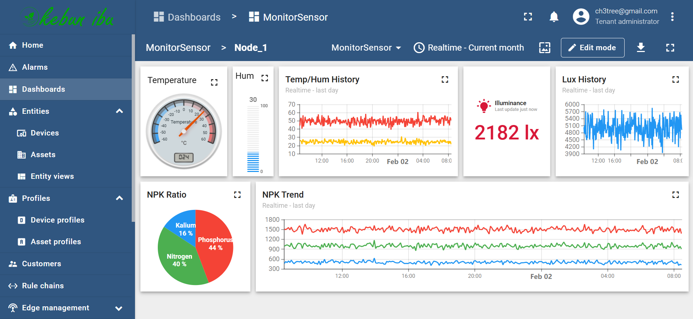

# Kebu (Kebun Ibu)

Selamat datang di repositori **Kebu (Kebun Ibu)**! Repositori ini mengumpulkan sumber daya untuk mengembangkan solusi pertanian cerdas untuk Kebun Ibu, sebuah inisiatif inovatif yang bertujuan untuk mengintegrasikan teknologi canggih dengan praktik pertanian tradisional. Di sini, Anda akan menemukan kumpulan perangkat lunak, firmware, dokumen, dan desain 3D yang digunakan tim kami untuk menciptakan sistem pertanian yang berkelanjutan, efisien, dan produktif.

Kebun Ibu berfokus pada transformasi pertanian melalui penggunaan **perangkat Internet of Things (IoT)**, **analisis data**, dan **sistem otomatis**. Tujuan kami adalah mengoptimalkan penggunaan sumber daya, meningkatkan hasil panen, dan mempromosikan metode pertanian yang ramah lingkungan. Dengan memanfaatkan teknologi terkini, kami bertujuan untuk memberdayakan petani dengan alat dan wawasan yang dapat mengarah pada pengambilan keputusan yang lebih baik dan manajemen pertanian yang lebih baik.

Untuk dokumentasi lengkap, panduan pengaturan, dan tutorial, silakan merujuk ke **[Kebu GitHub Wiki](https://github.com/chetree/kebu/wiki)**.

[Baca dalam Bahasa Inggris](README.md)

### Live Demo: 
Click this Link: **[Main Dasboard](https://tinyurl.com/kebunibu)**
```
Username: demo@kebunibu.com
Password: demo@kebunibu.com
```

### Sample Implementation


#### Sensor Node details


---

## Struktur Repositori

<!-- TREEVIEW START -->
```bash
kebu/
├── software/
│   ├── app/
│   ├── backend/
│   └── frontend/
├── firmware/
│   ├── sensors/
│   └── controllers/
├── docs/
│   ├── guides/
│   └── tutorials/
├── 3d_designs/
│   ├── enclosures/
│   └── components/
└── README.md
```
<!-- TREEVIEW END -->

---

## Perangkat Lunak
- **app/**: Berisi basis kode aplikasi mobile.
- **backend/**: Kode sisi server dan API.
- **frontend/**: Basis kode aplikasi web.

---

## Firmware
- **sensors/**: Firmware untuk berbagai sensor yang digunakan di kebun.
- **controllers/**: Firmware untuk pengontrol yang mengelola berbagai operasi pertanian.

---

## Dokumen
- **guides/**: Panduan pengguna dan panduan pengaturan.
- **tutorials/**: Tutorial langkah demi langkah untuk menggunakan dan merawat solusi kami.

Untuk dokumentasi lebih rinci, kunjungi **[Kebu GitHub Wiki](https://github.com/chetree/kebu/wiki)**.

---

## Desain 3D
- **enclosures/**: Model 3D untuk enclosure perangkat.
- **components/**: Model 3D untuk berbagai komponen yang digunakan dalam perangkat.

---

## Kasus Penggunaan dan Pengembangan

### Sistem Irigasi Otomatis
Kami mengembangkan **sistem irigasi otomatis** yang menggunakan sensor kelembaban tanah untuk menentukan jadwal penyiraman yang optimal. Hal ini mengurangi penggunaan air dan memastikan tanaman menerima jumlah air yang tepat.

### Pemantauan Lingkungan
Sensor kami memantau **suhu**, **kelembaban**, dan faktor lingkungan lainnya secara real-time. Data ini membantu petani membuat keputusan yang tepat tentang penanaman dan panen.

### Sistem Pengendalian Hama
Kami menggunakan **algoritma berbasis data** untuk memprediksi wabah hama dan menerapkan intervensi yang tepat, sehingga meminimalkan penggunaan pestisida kimia.

### Pelacakan Pertumbuhan
Perangkat lunak kami melacak pertumbuhan dan kesehatan tanaman menggunakan **pengenalan gambar** dan **algoritma pembelajaran mesin**, memberikan wawasan tentang perkembangan tanaman dan masalah potensial.

### Optimasi Sumber Daya
Kami menerapkan **teknik optimasi sumber daya** untuk memastikan penggunaan air, pupuk, dan energi yang efisien, serta mempromosikan praktik pertanian yang berkelanjutan.

Untuk informasi lebih lanjut tentang kasus penggunaan ini, kunjungi **[Kebu GitHub Wiki](https://github.com/chetree/kebu/wiki)**.

---

## TODO
- Mengintegrasikan sensor tambahan untuk pemantauan lingkungan yang lebih detail.
- Mengembangkan model pembelajaran mesin untuk analisis prediktif.
- Memperluas sistem irigasi otomatis untuk mendukung skenario multi-tanaman.
- Membuat dasbor yang ramah pengguna untuk visualisasi data real-time.
- Menerapkan manajemen daya yang hemat energi untuk semua perangkat IoT.

---

## Memulai
Untuk mulai menggunakan sumber daya di repositori ini, ikuti panduan di direktori **docs/** atau kunjungi **[Kebu GitHub Wiki](https://github.com/username-anda/kebu/wiki)** untuk instruksi lengkap. Jika ada masalah atau pertanyaan, silakan buka _issue_ atau hubungi kami langsung.

---

## Berkontribusi
Kami menyambut kontribusi! Silakan baca [panduan kontribusi](CONTRIBUTING.md) kami untuk memulai. Untuk detail lebih lanjut, kunjungi **[Kebu GitHub Wiki](https://github.com/username-anda/kebu/wiki)**.

---

## Lisensi
Proyek ini dilisensikan di bawah **Lisensi GPL v3**. Lihat file [LICENSE](LICENSE) untuk detailnya.

---
